# OpenText TeamSite DCR retriever

OpenText TeamSite component to retrieve information, Content Items, using LSCS API.

## About TeamSite
OpenText™ TeamSite™ is an easy-to-use, modern website content management system that helps 
organizations create personalized and visually rich digital customer experiences optimized 
for any device, digital channel or context. It simplifies the entire process of managing 
content across all channels, including websites, mobile platforms, email, social, commerce, 
composite applications, collaboration sites and portals, to make delivering outstanding digital 
experiences easier. From a single interface, users can author, test, target and publish their 
content as well as manage rich media, design websites and create mobile applications.

## Create a Content Template

Follow these steps to create a **Content Template**:

> NOTE: you can create your own DCR that fit your needs

   - Go to `Experience Studio`
   - Click on `Assets > Content items` on the left hand side menu
   
   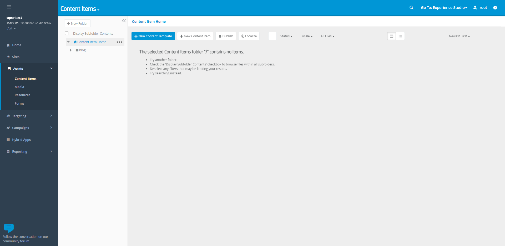
   
   - Click on `New Content Template` button

   - Set the following fields:
      - **Name**: Market      
      - **Category**: Economy
   - Drag & drop the following Data Elements:
      - `Text`, let's call it **name** 
      - `Browser`, let's call it **highlightedImage** 

   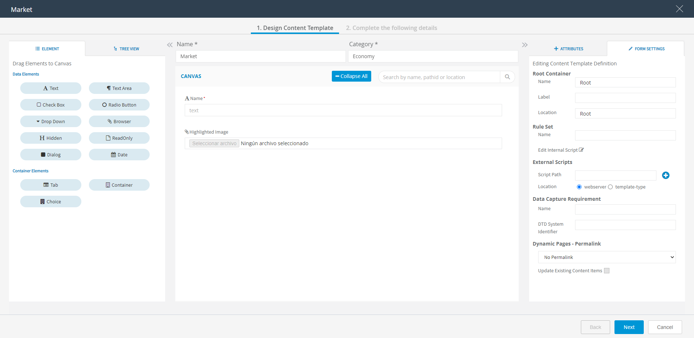
   
   
## Create a Content Item   

Follow these steps to create a **Content Item**, former Data Content Record (DCR):

   - Go to `Experience Studio`
   - Click on `Assets > Content items` on the left hand side menu

   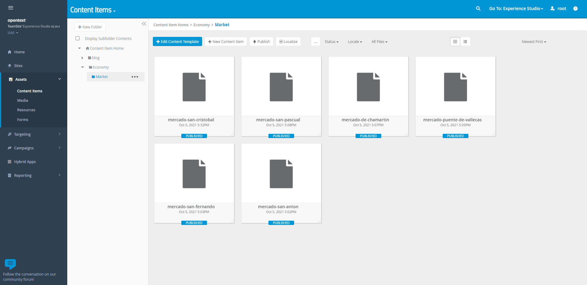
   
   - Click on `New Content Item` button

   - Add values to the Content Item
      
   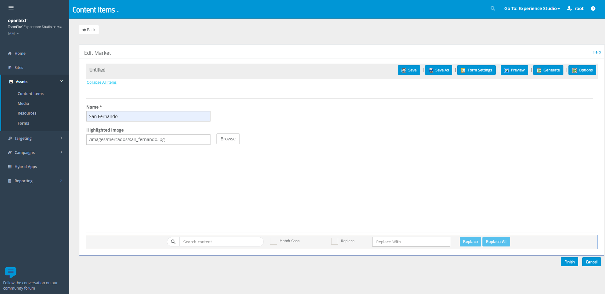
      
   - Click on `Finish` button
   
Repeat these steps several times to have some content available. (We'll use it later) 

## Create a custom component
Follow these steps to create a new component that use the class that we have created in this project:

   - Go to `CC Professional` and browse to `//tsbase/iwadmin/main/livesite/component/WORKAREA/shared`
   - Click on `File > New Folder`
   
   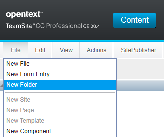
   
   - Set a name for your folder, `economy` in our example.
      
   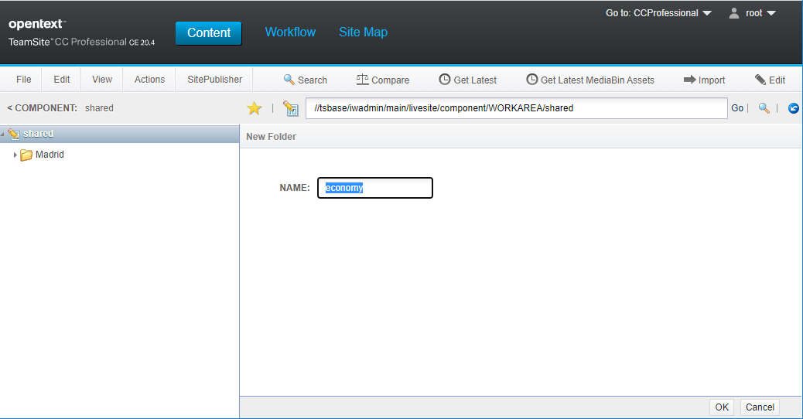
   
   - Browse to the new folder `//tsbase/iwadmin/main/livesite/component/WORKAREA/shared/economy`
   - Click on `File > New Component`

   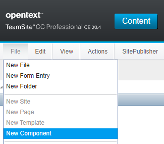
   
   - Select `XSLT 2.0` and click on `Next`
   
   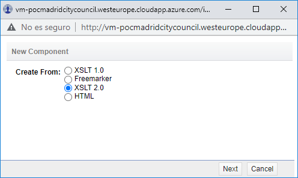   

   - Set a name, e.g. *ECON-Market-DCR-Retrieve*
   - Select `Do not cache` on the **Cache Time** dropdown list
   
   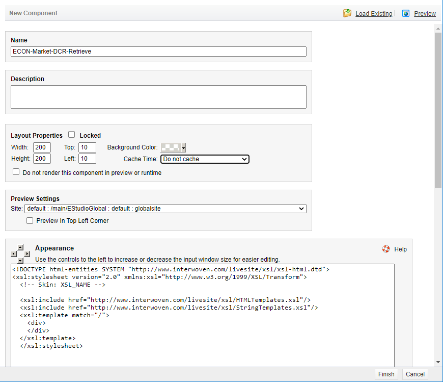      
   
   - Scroll down until the section **Content XML** is visible
   - Copy this code into the **Content XML** text area:
   
```xml
<Data>
  <External>
    <Parameters>
      <Datum ID="DOCUMENT-QUERY" Name="documentQuery" Type="String">q=TeamSite/Templating/DCR/Type:Economy/Market</Datum>
    </Parameters>
    <Object Scope="local">com.opentext.teamsite.sc.dcr.DCRRetriever</Object>
    <Method>getDCRAssets</Method>
  </External>
</Data>
```

> **NOTE**: `com.opentext.teamsite.sc.dcr.DCRRetriever` is the class created by us in this project.
> `documentQuery` parameter defines the query string that we'll use to retrieve information using
> the **LiveSite Content Services (LSCS) API**.


In our example, LSCS API will return and XML that looks like this:

```xml
<Properties ComponentID="1632917363172"><Data>
		<External>
			<Parameters>
				<Datum Type="String" Name="RequestHeaders">[accept-language] = [es,es-ES;q=0.9,en;q=0.8,fr-FR;q=0.7,fr;q=0.6]
                  [cookie] = [iw_which_ui=; iw_domain=""; dashboard_getting_started_panel_show=; IWAUTH=52616e646f6d49563b8fdafa82a18a7f9f13118d620b5c5751eef2f0c87914e09217819723f594f5f2cd62bc7c2675a60f2543d6f2417692;
                  iw_user=root; JSESSIONID=84B151F9F8574478C578F5237BF31AE4; IWPROXY_PATHTRACK=/iw-mount/default/main/IAM/WORKAREA/default/images/logos/logo-madrid-investment-attraction.png]
                  [host] = [vm-pocmadridcitycouncil.westeurope.cloudapp.azure.com:1776]
                  [upgrade-insecure-requests] = [1]
                  [connection] = [keep-alive]
                  [cache-control] = [no-cache]
                  [pragma] = [no-cache]
                  [accept-encoding] = [gzip, deflate]
                  [user-agent] = [Mozilla/5.0 (Windows NT 10.0; WOW64) AppleWebKit/537.36 (KHTML, like
                  Gecko) Chrome/94.0.4606.61 Safari/537.36]
                  [accept] = [text/html,application/xhtml+xml,application/xml;q=0.9,image/avif,image/webp,image/apng,*/*;q=0.8,application/signed-exchange;v=b3;q=0.9]
				</Datum>
				<Datum Type="String" Name="documentQuery">q=TeamSite/Templating/DCR/Type:Economy/Market</Datum>
				<Datum Type="String" Name="iw-ls-page-name">test</Datum>
			</Parameters>
		</External>
		<Result>
			<root>
				<results>
					<document id="4baec5cb35be39804bf52a50e66d7f05" path="templatedata/Economy/Market/data/mercado-san-cristobal.xml" uri="http://localhost:1876/lscs/v1//document/id/4baec5cb35be39804bf52a50e66d7f05/context/1e8b456836d4483aec07994773ded6d9">
						<metadata>
							<field name="area">/default/main/IAM/WORKAREA/default</field>
							<field name="TeamSite/Metadata/Locale">en_US</field>
							<field name="TeamSite/LiveSite/Id">ktedkyfq</field>
							<field name="TeamSite/Metadata/CreationDate">2021-10-05 11:32:21</field>
							<field name="iw_form_valid">true</field>
							<field name="G11N/Localizable">true</field>
							<field name="TeamSite/Templating/DCR/Type">Economy/Market</field>
							<field name="ast_id">ktedkyfq</field>
							<field name="AreaRelativePath">templatedata/Economy/Market/data/mercado-san-cristobal.xml</field>
							<field name="LatestModifiedDate">2021-10-05 11:33:01</field>
							<field name="StagingVpath">/default/main/IAM/STAGING</field>
							<field name="BranchVpath">/default/main/IAM</field>
							<field name="G11N/Locale">es_ES</field>
							<field name="AbsoluteVpath">/default/main/IAM/WORKAREA/default/templatedata/Economy/Market/data/mercado-san-cristobal.xml</field>
							<field name="ast_last_modified_date">2021-10-05 11:33:01</field>
							<field name="ast_path">templatedata/Economy/Market/data/mercado-san-cristobal.xml</field>
							<field name="TeamSite/Assocation/Version">1</field>
						</metadata>
						<content>
							<Root>
								<name>San Cristobal</name>
								<highlightedImage>/images/mercados/san_cristobal.jpg</highlightedImage>
							</Root>
						</content>
					</document>
				</results>
			</root>
		</Result>
	</Data>
</Properties>
```

Having in mind the expected output of our query, we can set the `Appearance` of our component:

```xslt
<!DOCTYPE html-entities SYSTEM "http://www.interwoven.com/livesite/xsl/xsl-html.dtd">
<xsl:stylesheet version="2.0" xmlns:xsl="http://www.w3.org/1999/XSL/Transform">
   <!-- Skin: XSL_NAME -->
   <xsl:include href="http://www.interwoven.com/livesite/xsl/HTMLTemplates.xsl"/>
   <xsl:include href="http://www.interwoven.com/livesite/xsl/StringTemplates.xsl"/>
   <xsl:template match="/">
      <section class="mee-home-slides mee-home-mercados-slides">
         
         <div class="uk-container uk-text-center">
            <h2 class="mee-home-slides-title">Descubre Mercados</h2>
            <a href="#" class="uk-button uk-button-link">
            Ver todos los mercados
            <span class="uk-margin-large-left" data-uk-icon="icon: chevron-right; ratio: 1.1" aria-hidden="true" />
            </a>
         </div>
         <div class="uk-container">
            <div data-uk-slider="autoplay: true; autoplay-interval: 5000">
               <div class="uk-position-relative uk-visible-toggle" tabindex="-1">
                  <div class="uk-slider-container">
                     <ul class="uk-slider-items uk-child-width-1-2@s uk-child-width-1-4@m uk-child-width-1-5@l" data-uk-grid="true">
                        <xsl:for-each select="Properties/Data/Result/root/results/document/content/Root">
                           <li>
                              <a href="mercado-individual.html" class="card-mercados-wrap" aria-label="Ver mercado">
                                 <div class="card-mercados">
                                    
                                    <xsl:attribute name="src" select="highlightedImage"/>
                                    <xsl:attribute name="alt" select="name"/>
                                    </img>
                                    <div class="card-mercados-title-wrap">
                                       <h3 class="card-mercados-title">
                                          <xsl:value-of select="name"/>
                                       </h3>
                                    </div>
                                 </div>
                              </a>
                           </li>
                        </xsl:for-each>
                     </ul>
                  </div>
                  <a class="uk-position-center-left-out uk-position-small" href="#" data-uk-slidenav-previous="true" data-uk-slider-item="previous" aria-label="Anterior" />
                  <a class="uk-position-center-right-out uk-position-small" href="#" data-uk-slidenav-next="true" data-uk-slider-item="next" aria-label="Siguiente" />
               </div>
            </div>
         </div>
      </section>
   </xsl:template>
</xsl:stylesheet>
```

> NOTE: This is a simple HTML example. You must use the HTML that fits your needs in terms of presentation.

 - Click on `Save and Close`
 
 - Click on the check box close to your component
 - Click on `Submit` button
 
 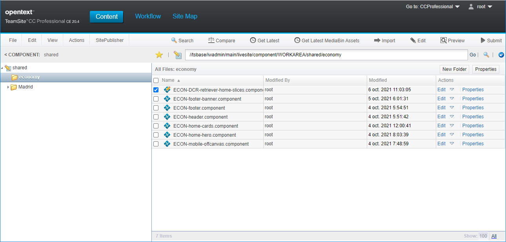
 
 - Click on `Run job`
 
  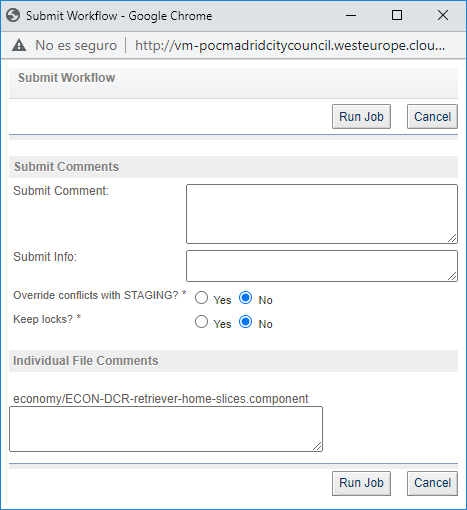
 

## Using our component

Follow these steps to use our component in a page:

   - Go to `Experience Studio`
   - Click on `Sites`
   - Click on `New Page`
 
   
   
   - Click on `Add Component`

   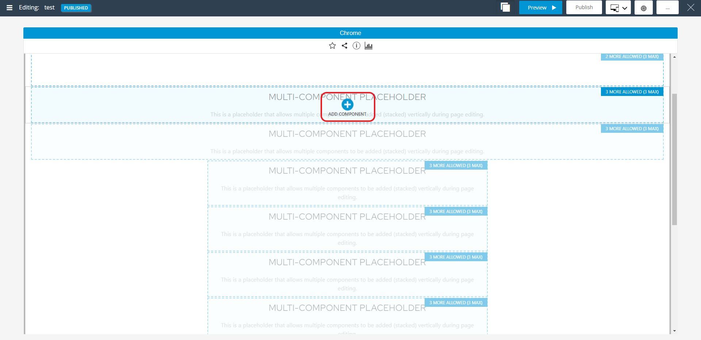   

   - Select our component under the `Custom components` folder struture
   
       
   
   - Close editing window
   
       
   
   - Click on `...` icon    
   - Click on `Publish Now` menu item    
   
   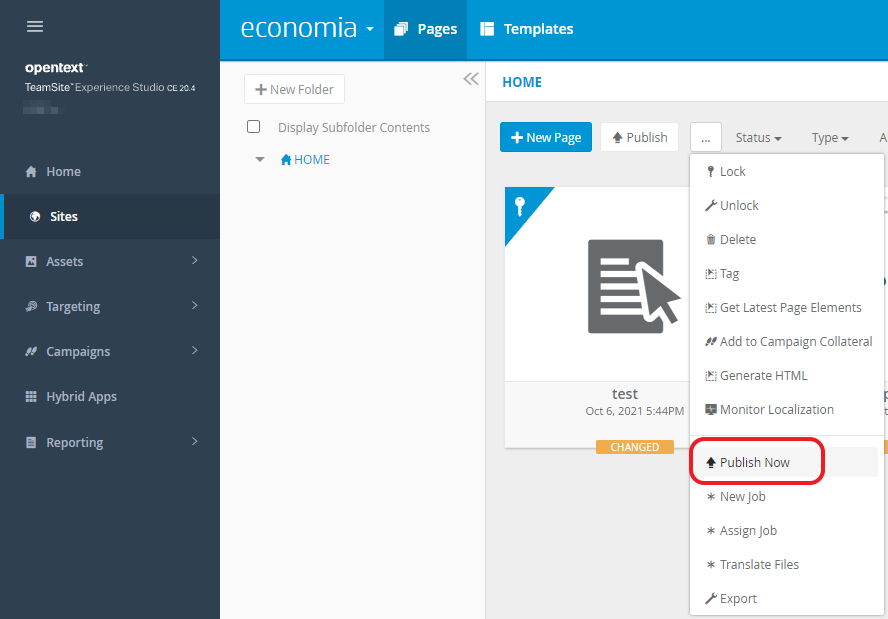    
   
   - Select the page and click on `Publish Now` button    
   
It's done. Now you can check your page in the live site. 
   
## Environment setup 

### Deploy jar file

The `output` folder of this project contains a jar file with the classes to retrieve DCR using 
TeamSite's LSCS API (Live Site Content Site API).

#### Deploy for development/testing your component
Upload the jar file, `OTTeamSiteDCRRetriever20.4.jar` in our example, to the `lib` folder of your environment:

``` 
/usr/Interwoven/LiveSiteDisplayServices/runtime/web/WEB-INF/lib 
```

> **IMPORTANT**: This speed up the testing process, but the preview of the process won't work. 
> You'll need to publish the page that contains the component to see the results.

#### Deploy for real live (component tested and ready to use)
Upload the jar file, `OTTeamSiteDCRRetriever20.4.jar` in our example, to the `lib` folder of your environment:

``` 
/usr/Interwoven/TeamSite/local/config/lib/content_center/livesite_customer_src/lib 
```

```
cd /usr/Interwoven/TeamSite/local/config/lib/content_center/livesite_customer_src
./build.sh 	
```

### Enable log messages in log4j

Browse to the following folder:

```
cd /usr/Interwoven/LiveSiteDisplayServices/runtime/web/WEB-INF/classes
```

Edit the `log4j.xml` file and add the following tag:

```
<category name="com.opentext.teamsite.sc.dcr.DCRRetriever"><priority value="DEBUG"/></category>
```

> NOTE: `com.opentext.teamsite.sc.economy.DCRRetriever` is the class that we have created

### Restart Tomcat

Once you have deployed the jar, execute the following commands to restart Tomcat:

```
cd /usr/Interwoven/LiveSiteDisplayServices/runtime/
ls -l
./run.linux.sh stop
```
	
Wait 2 minutes and run this command:
	
```	
./run.linux.sh start
```

### Check you component logs

#### TeamSite LiveSite logs

Execute the following commands in a terminal to see the logs of your component:

```
cd /usr/Interwoven/LiveSiteDisplayServices/runtime/tomcat/logs/
cat /dev/null > livesite.runtime.log
clear
tail -f livesite.runtime.log	
```

#### TeamSite Preview logs

```
cd /usr/Interwoven/TeamSite/local/logs/iwui
tail -f livesite.preview.log
```
