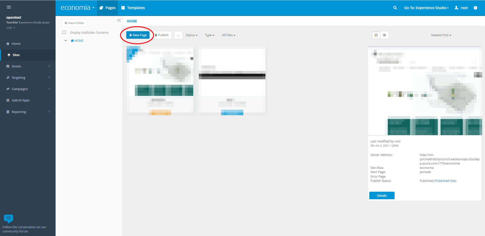
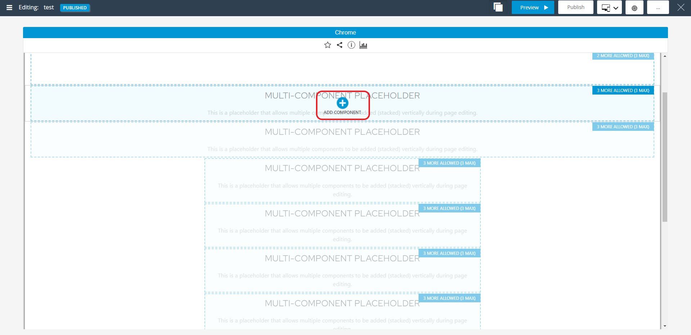
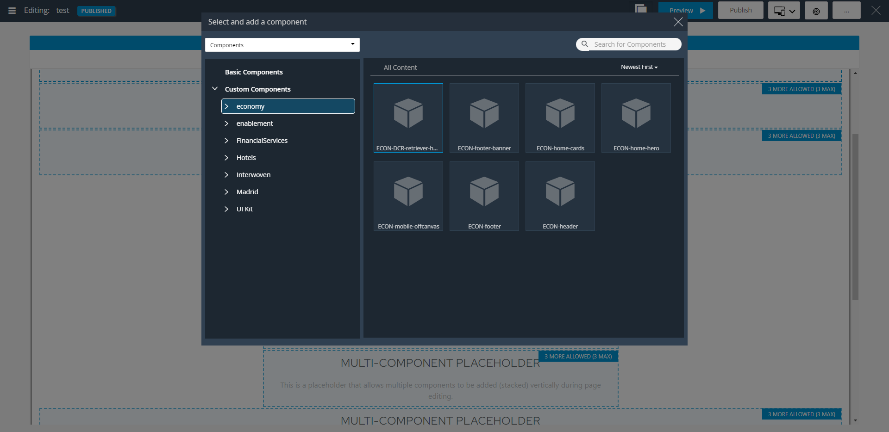
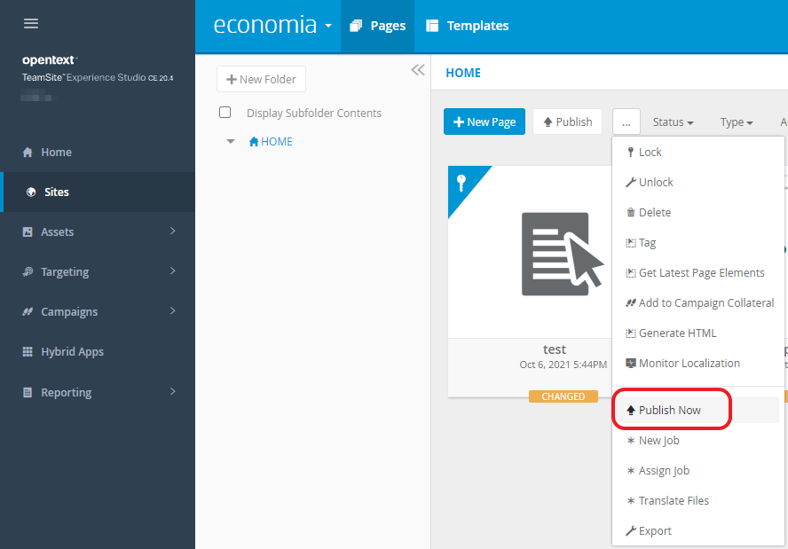

# OpenText TeamSite DCR retriever

**OpenText TeamSite components** to retrieve information:
                           
   - [DCR retriever](pages/DCRRetriever.md) : TeamSite component to retrieve information, Content Items, using LSCS API.
   - [OTMM Retriever](pages/OTMMRetriever.md): TeamSite component to retrieve assets included in an **OpenText Media Management (OTMM)** collection.

## About TeamSite
OpenText™ TeamSite™ is an easy-to-use, modern website content management system that helps 
organizations create personalized and visually rich digital customer experiences optimized 
for any device, digital channel or context. It simplifies the entire process of managing 
content across all channels, including websites, mobile platforms, email, social, commerce, 
composite applications, collaboration sites and portals, to make delivering outstanding digital 
experiences easier. From a single interface, users can author, test, target and publish their 
content as well as manage rich media, design websites and create mobile applications.

## Using our component

Follow these steps to use our component in a page:

   - Go to `Experience Studio`
   - Click on `Sites`
   - Click on `New Page`
 
   
   
   - Click on `Add Component`

      

   - Select our component under the `Custom components` folder struture
   
       
   
   - Close editing window
   
       
   
   - Click on `...` icon    
   - Click on `Publish Now` menu item    
   
       
   
   - Select the page and click on `Publish Now` button    
   
It's done. Now you can check your page in the live site. 
   
## Environment setup 

### Deploy jar file

The `output` folder of this project contains a `jar`  file with the classes created.

#### Deploy for develop/test your component
Upload the jar file, `OTTeamSiteDCRRetriever20.4.jar` in our example, to the `lib` folder of your environment:

``` 
/usr/Interwoven/LiveSiteDisplayServices/runtime/web/WEB-INF/lib 
```

> **IMPORTANT**: This speed up the testing process, but the preview of the process won't work. 
> You'll need to publish the page that contains the component to see the results.

#### Deploy for real live (component tested and ready to use)
Upload the jar file, `OTTeamSiteDCRRetriever20.4.jar` in our example, to the `lib` folder of your environment:

``` 
/usr/Interwoven/TeamSite/local/config/lib/content_center/livesite_customer_src/lib 
```

```
cd /usr/Interwoven/TeamSite/local/config/lib/content_center/livesite_customer_src
./build.sh 	
```

### Enable log messages in log4j

Browse to the following folder:

```
cd /usr/Interwoven/LiveSiteDisplayServices/runtime/web/WEB-INF/classes
```

Edit the `log4j.xml` file and add the following tag:

```xml
<category name="com.opentext.teamsite.sc.retriever.DCRRetriever"><priority value="DEBUG"/></category>
<category name="com.opentext.teamsite.sc.retriever.OTMMRetriever"><priority value="DEBUG"/></category>
```

> NOTE: `com.opentext.teamsite.sc.economy.*` are the classes that we have created

### Restart Tomcat

Once you have deployed the jar, execute the following commands to restart Tomcat:

```
cd /usr/Interwoven/LiveSiteDisplayServices/runtime/
ls -l
./run.linux.sh stop
```
	
Wait 2 minutes and run this command:
	
```	
./run.linux.sh start
```

### Check you component logs

#### TeamSite LiveSite logs

Execute the following commands in a terminal to see the logs of your component:

```
cd /usr/Interwoven/LiveSiteDisplayServices/runtime/tomcat/logs/
cat /dev/null > livesite.runtime.log
clear
tail -f livesite.runtime.log	
```

#### TeamSite Preview logs

```
cd /usr/Interwoven/TeamSite/local/logs/iwui
tail -f livesite.preview.log
```
