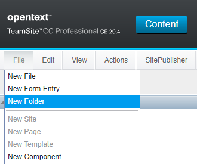
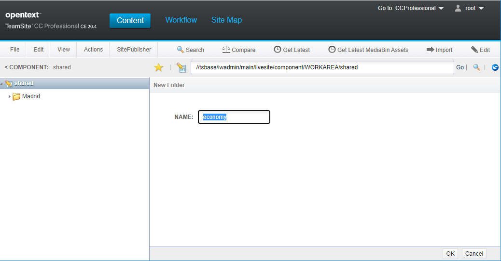
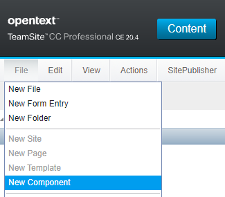
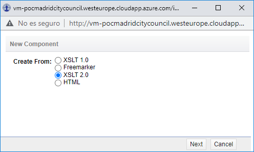
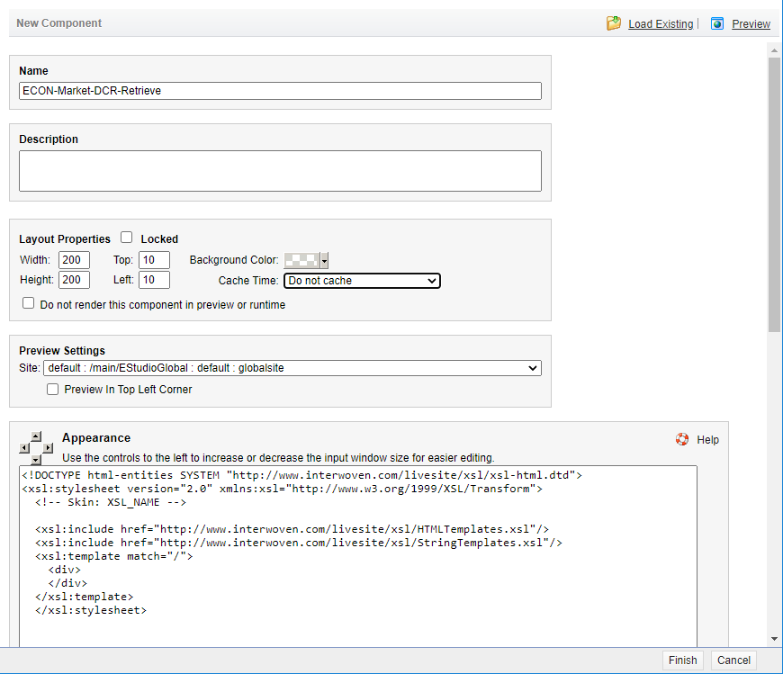
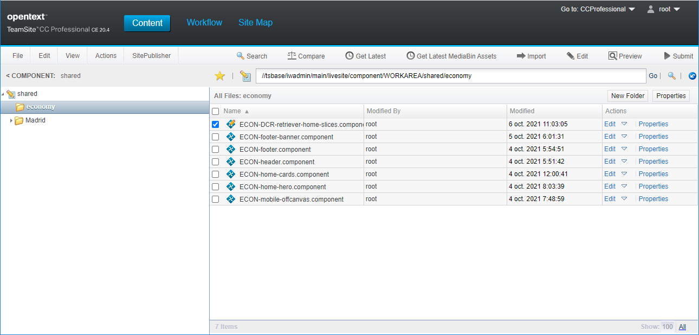
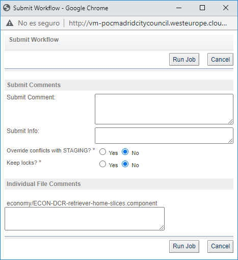

# OpenText TeamSite component: OTMM Retriever

**OpenText TeamSite component** to retrieve assets included in an **OpenText Media Management (OTMM)** collection.

## Create a custom component
Follow these steps to create a new component that use the class that we have created in this project:

   - Go to `CC Professional` and browse to `//tsbase/iwadmin/main/livesite/component/WORKAREA/shared`
   - Click on `File > New Folder`
   
   
   
   - Set a name for your folder, `economy` in our example.
      
   
   
   - Browse to the new folder `//tsbase/iwadmin/main/livesite/component/WORKAREA/shared/economy`
   - Click on `File > New Component`

   
   
   - Select `XSLT 2.0` and click on `Next`
   
      

   - Set a name, e.g. *OTMM-retrieve-collection*
   - Select `Do not cache` on the **Cache Time** dropdown list
   
         
   
   - Scroll down until the section **Content XML** is visible
   - Copy this code into the **Content XML** text area:
   
```xml
<Data>
  <External>
    <Parameters>
      <Datum ID="DOCUMENT-QUERY" Name="collection" Type="String">Auckland</Datum>
      <!-- Optional parameters -->
      <!-- 
	      <Datum ID="OTMM-URL" Name="url" Type="String"></Datum>
     	 <Datum ID="OTMM-USER" Name="user" Type="String"></Datum>
	      <Datum ID="OTMM-PASSWORD" Name="password" Type="String"></Datum>                  
      -->
    </Parameters>
    <Object Scope="local">com.opentext.teamsite.sc.retriever.OTMMRetriever</Object>
    <Method>retrieveAllAssetsOfACollectionByName</Method>
  </External>
</Data>
```

> **NOTE**: `com.opentext.teamsite.sc.retriever.OTMMRetriever` is the class created by us in this project.
> These are the supporter parameters
>  - `collection`: (Mandatory) Collection name
>  - `url`: (Optional) OTMM URL
>  - `user`: (Optional) OTMM user
>  - `password`: (Optional) OTMM password


In our example, our component returns and XML that looks like this:

> Please REVIEW XML!!!!!

```xml
<?xml version=\"1.0\" encoding=\"UTF-8\"?>
<collection>
	<asset>
		<id>f3bb958da1da37f8db6bc95988fa4c46071745a7</id>
		<name>Auckland_Harbor-1.JPG</name><mimeType>image/jpeg</mimeType>
		<deliveryServiceURL>http://mydemoserver.com/adaptivemedia/rendition?id=45fe8cbf156f06d18e293f95eb0c89faba9af16e</deliveryServiceURL>
	</asset>
	<asset>
		<id>b8fc7a4377053c4cb8c004cef29136cc5db759d4</id>
		<name>Mudbrick-1.JPG</name><mimeType>image/jpeg</mimeType>
		<deliveryServiceURL>http://mydemoserver.com/adaptivemedia/rendition?id=b8fc7a4377053c4cb8c004cef29136cc5db759d4</deliveryServiceURL>
	</asset>
</collection>
```

Having in mind the expected output of our query, we can set the `Appearance` of our component:

```xslt
<!DOCTYPE html-entities SYSTEM "http://www.interwoven.com/livesite/xsl/xsl-html.dtd">
<xsl:stylesheet version="2.0" xmlns:xsl="http://www.w3.org/1999/XSL/Transform">
   <!-- Skin: XSL_NAME -->
   <xsl:include href="http://www.interwoven.com/livesite/xsl/HTMLTemplates.xsl"/>
   <xsl:include href="http://www.interwoven.com/livesite/xsl/StringTemplates.xsl"/>
   <xsl:template match="/">
      <section class="mee-home-slides mee-home-mercados-slides">
         
         <div class="uk-container uk-text-center">
            <h2 class="mee-home-slides-title">Descubre Mercados</h2>
            <a href="#" class="uk-button uk-button-link">
            Ver todos los mercados
            <span class="uk-margin-large-left" data-uk-icon="icon: chevron-right; ratio: 1.1" aria-hidden="true" />
            </a>
         </div>
         <div class="uk-container">
            <div data-uk-slider="autoplay: true; autoplay-interval: 5000">
               <div class="uk-position-relative uk-visible-toggle" tabindex="-1">
                  <div class="uk-slider-container">
                     <ul class="uk-slider-items uk-child-width-1-2@s uk-child-width-1-4@m uk-child-width-1-5@l" data-uk-grid="true">
                        <xsl:for-each select="Properties/Data/Result/root/results/document/content/Root">
                           <li>
                              <a href="mercado-individual.html" class="card-mercados-wrap" aria-label="Ver mercado">
                                 <div class="card-mercados">
                                    
                                    <xsl:attribute name="src" select="highlightedImage"/>
                                    <xsl:attribute name="alt" select="name"/>
                                    </img>
                                    <div class="card-mercados-title-wrap">
                                       <h3 class="card-mercados-title">
                                          <xsl:value-of select="name"/>
                                       </h3>
                                    </div>
                                 </div>
                              </a>
                           </li>
                        </xsl:for-each>
                     </ul>
                  </div>
                  <a class="uk-position-center-left-out uk-position-small" href="#" data-uk-slidenav-previous="true" data-uk-slider-item="previous" aria-label="Anterior" />
                  <a class="uk-position-center-right-out uk-position-small" href="#" data-uk-slidenav-next="true" data-uk-slider-item="next" aria-label="Siguiente" />
               </div>
            </div>
         </div>
      </section>
   </xsl:template>
</xsl:stylesheet>
```

> NOTE: This is a simple HTML example. You must use the HTML that fits your needs in terms of presentation.

 - Click on `Save and Close`
 
 - Click on the check box close to your component
 - Click on `Submit` button
 
 
 
 - Click on `Run job`
 
  
 
